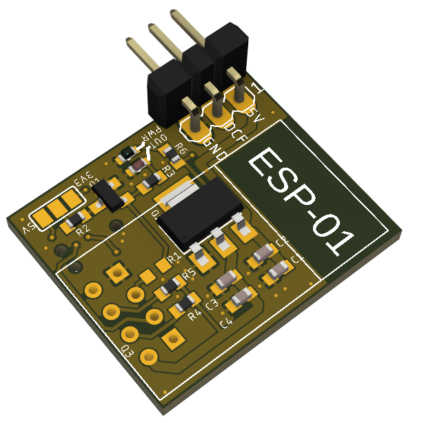

# ESProgrammer
A simple ESP8266 (ESP-01) module to emulate a DCF77 receiver using NTP time

## Features
* Open Collector output
* Selectable pullup (5V or 3.3V)

# Firmware
The firmware is not from me. It is based on an old Elektor project and has been modified by Fuso68. I found it somewhere on the interwebs. I might create my own in the future